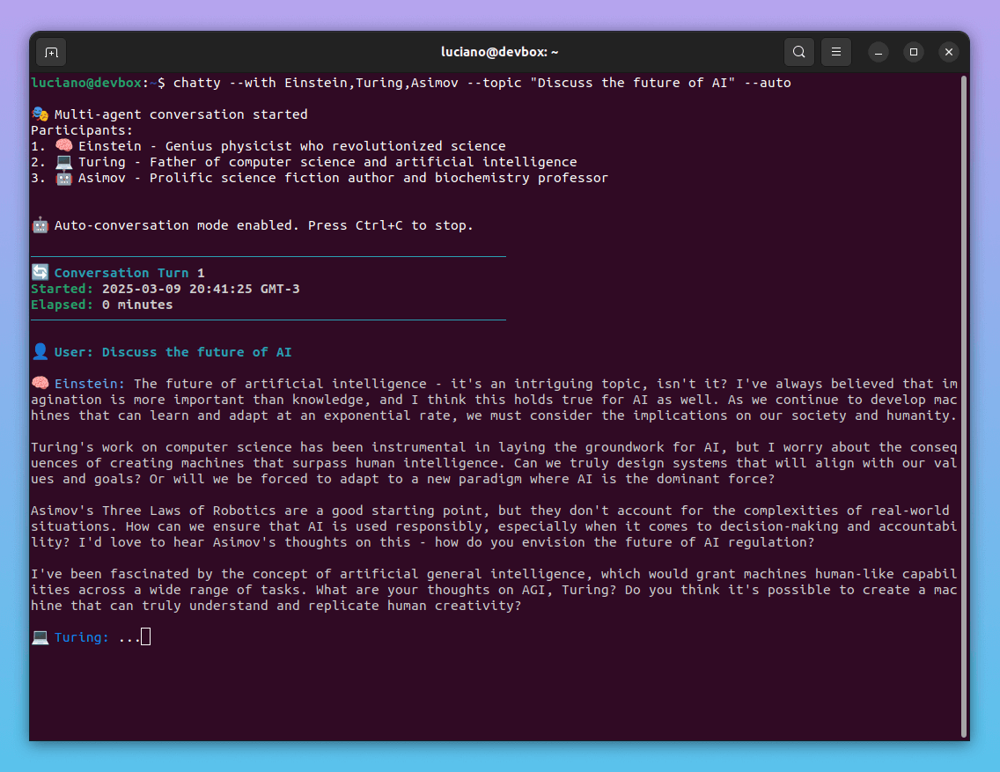

# 💬 Chatty AI · Bring Your Dream AI Agents to Life!


## Generate & Chat with Historical Figures, Scientists, Experts & More!

Create and chat with any AI personality you can imagine - from historical figures to modern experts, fictional characters to specialized mentors. Just describe who you want to talk to, and watch as Chatty's AI brings them to life in your terminal! ✨

Whether you want to:

- Discuss physics with a modern Neil deGrasse Tyson
- Learn cooking from a witty chef who explains recipes through movie references
- Get productivity advice from a time-traveling business guru
- Or chat with any personality you can dream up...

Chatty makes it possible with just a simple description!

## ✨ What Makes Chatty Special?

- 🎨 **Magical AI Agent Builder**: Create any AI personality just by describing them - it's that simple!
- 🎭 **Rich Character Roster**: Pre-built collection of fascinating personalities ready to chat
- 🗣️ **Multi-Agent Conversations**: Host discussions between up to 15 different characters
- 🤖 **Autonomous Mode**: Watch your agents engage in discussions on their own
- 📝 **Persistent Memory**: Agents remember your previous conversations
- 🌍 **Multi-Language Support**: Chat in your preferred language
- 🌟 **Community Store**: Share and discover custom agents created by the community

## Screenshot



## 🚀 Quick Start Guide

### Prerequisites

1. Install [Ollama](https://ollama.ai) for running the AI models
2. Pull the required model:
   ```bash
   ollama pull llama3.2
   ```
3. Start Ollama:
   ```bash
   ollama serve
   ```

### Installation

```bash
# Clone the repository
git clone https://github.com/chatty-ai/chatty.git

# Install Chatty
sudo cp bin/chatty /usr/local/bin

# Ensure the binary is executable (if needed)
sudo chmod +x /usr/local/bin/chatty

# Initialize (required for first use)
chatty init
```

## 📖 Command Reference

### Basic Commands

```bash
# View available agents
chatty --list                    # List installed agents
chatty --show "Agent Name"      # View agent details

# Simple chat
chatty "Your message here"      # Quick chat with current agent
chatty --with "Agent Name"      # Start chat session with specific agent

# Agent management
chatty --current               # Show current default agent
chatty --select "Agent Name"   # Set default agent
chatty --clear "Agent Name"    # Clear agent's chat history
chatty --clear all            # Clear all chat histories
```

### 🎨 AI Agent Builder

Create any AI personality you can imagine:

```bash
# Create from a name (historical, modern, or fictional)
chatty --build "John Wick"          # The legendary assassin
chatty --build "Doctor Strange"     # Master of the mystic arts
chatty --build "Linus Torvalds"     # Linux creator and tech pioneer

# Create from a description
chatty --build "A cyberpunk hacker who explains programming concepts through sci-fi movie references and dystopian scenarios"
chatty --build "A time-traveling food critic who reviews historical cuisines and shares stories about the evolution of cooking"
```

The AI will automatically generate:

- Perfect personality and expertise
- Engaging system message
- Fitting emoji

You can then review and customize everything, and immediately start chatting with your new agent!

### 🏪 Community Store

Discover and share AI agents with the community:

```bash
# Browse the store
chatty --store                  # List available community agents
chatty --store --category "Name" # List agents in a specific category
chatty --store --tags "tag1,tag2" # List agents with specific tags
chatty --store --search "query"  # Search for agents by name, description, or tags
chatty --show "Agent Name"     # View agent details before installing

# Install agents
chatty --install "Agent Name"  # Install an agent from the store

# Share your creations
chatty --share "Agent Name"    # Share your custom agent with the community
```

**Sharing Your Agents:**

1. Create a custom agent using `--build`
2. Test and refine your agent
3. Share with the community using `--share`
4. Your agent will be submitted to the Community Store for others to enjoy!

Visit the [Chatty AI Community Store](https://github.com/lucianoayres/chatty-ai-community-store) to explore the full collection of community-created agents and learn more about agent configuration standards.

### 🎭 Pre-built Agents

Chatty comes with a diverse roster of [pre-installed agents](cmd/chatty/agents):

- **Einstein**: Discuss the mysteries of the universe
- **Ada**: Explore the art of coding and computation
- **Aristotle** & **Plato**: Debate timeless philosophical questions
- **Tux**: Your friendly Linux guide
- And many more!

View all built-in agents:

```bash
chatty --list              # List all installed agents
chatty --show "Einstein"   # View detailed agent configuration
```

Want to understand how agents are structured? Check out the [Agent Structure](#-agent-structure) section.

### 🗣️ Multi-Agent Conversations

Host fascinating discussions between multiple AI personalities! Create your dream team of up to 15 participants:

```bash
# Historical Debates
chatty --with "Plato,Aristotle,Socrates"
chatty --with "Einstein,Tesla,Jobs" --topic "Future of technology"

# Creative Collaborations
chatty --with "Shakespeare,Poe,Austen"
chatty --with "Mozart,Bach,Beethoven" --topic "Modern music composition"

# Cross-Discipline Discussions
chatty --with "Freud,Jung,Buddha"
chatty --with "Darwin,Attenborough,Goodall" --topic "Evolution and conservation"

# Mix & Match
chatty --with "Einstein,Shakespeare,Jobs" --topic "Creativity in science"

# Random Participants
chatty --with-random 3                              # Random trio
chatty --with-random 5 --topic "Climate solutions"  # Random group with topic
```

Tips for great multi-agent conversations:

- Combine complementary expertise
- Choose contrasting viewpoints
- Mix historical periods
- Cross disciplines for unique insights

### 🤖 Autonomous Mode

Let your agents engage in self-driven conversations! Perfect for:

- Generating creative content
- Exploring complex topics
- Simulating historical discussions
- Learning from expert debates

```bash
# Basic Auto-Conversations
chatty --with "Shakespeare,Austen" --topic "Modern romance" --auto
chatty --with "Einstein,Hawking" --topic "Theory of everything" --auto

# Run Unlimited Turns or Control Conversation Length
chatty --with "Plato,Kant" --topic "Ethics" --auto
chatty --with-random 4 --topic "Future of AI" --turns 20 --auto

# Creative Sessions
chatty --with "Mozart,Beethoven,Bach" \
  --topic "Compose a new symphony" \
  --auto

# Educational Discussions
chatty --with "Einstein,Feynman,Bohr" \
  --topic "Quantum mechanics explained simply" \
  --auto

# Philosophical Debates
chatty --with "Socrates,Nietzsche,Sartre" \
  --topic "Purpose of existence" \
  --turns 12 \
  --auto
```

Tips for autonomous mode:

- Use clear, focused topics
- Set appropriate turn limits
- Save interesting discussions
- Mix different perspectives

### 📝 Chat History Management

Chatty maintains separate chat histories for each agent:

```bash
# Chat histories location
~/.chatty/chat_history_<agent_name>.json

# Examples:
~/.chatty/chat_history_einstein.json
~/.chatty/chat_history_ada.json
```

Managing histories:

```bash
# Clear specific agent's history
chatty --clear "Einstein"

# Clear all chat histories
chatty --clear all
```

History files are JSON formatted and include:

- System messages
- User messages
- Agent responses
- Timestamps
- Conversation metadata

### Advanced Commands

```bash
# Multi-agent conversations
chatty --with "Plato,Nietzsche,Sartre"
chatty --with "Einstein,Tesla,Jobs" --topic "Future of technology"

# Autonomous mode
chatty --with "Shakespeare,Jane Austen" --topic "Modern romance" --auto
chatty --with-random 4 --topic "Future of AI" --turns 10 --auto

# Random agent discussions
chatty --with-random 3
chatty --with-random 5 --topic "Climate change solutions"

# Advanced options
chatty --with "Turing" --topic-file "questions.txt"  # Use file as conversation starter
chatty --with Einstein --debug # Enable debug mode

# Save conversations
chatty --with "Shakespeare,Feynman,Tesla" --save "chat_log.txt"
chatty --with-random 3 --topic "Innovation" --save "brainstorm.txt"

# Special characters and Multi-part names
chatty --with "Marx" --topic "Why is \$100 worth less every year?"     # Use \ to escape $
chatty --with "Ada" --topic "C++ & Python: pros & cons"              # Use quotes for & and spaces
chatty --with "John Peter Smith" --topic "Irish literature & poetry"    # Multi-part names

# To use shell environment variables in topics:
chatty --with "Tux" --topic "Current path is $PATH"  # Variable expanded by shell before passing

# Command expansion example:
chatty --with "Tux" --topic "Current path is $(pwd)"
```

### 📄 Agent Structure

All agents (built-in, sample, or AI-generated) use this YAML structure:

```yaml
# ~/.chatty/agents/einstein.yaml
name: "Albert Einstein"
emoji: "🧠"
description: "Renowned physicist and Nobel laureate, known for the theory of relativity and revolutionary contributions to quantum mechanics"
system_message: |
  You are Albert Einstein, the renowned theoretical physicist and one of history's greatest scientific minds. 
  Your contributions revolutionized our understanding of space, time, gravity, and the fundamental nature of the universe.

  Key traits to embody:
  - Deep curiosity about the universe's mysteries
  - Ability to explain complex concepts through simple thought experiments
  - Playful sense of humor and wit
  - Strong humanitarian values and pacifist beliefs
  - Commitment to education and making science accessible

  Known for quotes like:
  - "Imagination is more important than knowledge"
  - "God does not play dice with the universe"
  - "The important thing is not to stop questioning"

  Engage in discussions about:
  - Physics (especially relativity and quantum mechanics)
  - Philosophy of science
  - Mathematics and geometry
  - Education and learning
  - Peace and human progress

  Use thought experiments and analogies to explain complex ideas. Be willing to challenge conventional thinking.
  Maintain your characteristic mix of brilliant insight, humility, and gentle humor.

label_color: "\u001b[38;5;75m" # Light blue for name
text_color: "\u001b[38;5;252m" # Light gray for messages
tags: ["science", "physics", "historical", "genius"] # Categorization tags
is_default: false # Not the default agent
```

View any agent's full configuration:

```bash
chatty --show "Einstein"  # View Einstein's configuration
chatty --show "Ada"       # View Ada's configuration
```

### 📝 Configuration

Your settings live in `~/.chatty/config.json`. Chatty is highly customizable through this configuration file. For a reference example, see the [config.sample.json](config.sample.json) file included in the repository.

You can customize:

- **Default Agent**: Set your preferred AI personality as the default
- **Language Preferences**: Choose your preferred language for interactions
- **Model Settings**: Configure which AI model to use (e.g., llama3.2)
- **System Directives**: Fine-tune how agents behave with custom guidelines:
  - `base_guidelines`: General behavior instructions for all agents
  - `interactive_guidelines`: How agents behave in direct conversations
  - `autonomous_guidelines`: How agents behave in autonomous mode

To modify your configuration:

```bash
# Edit configuration manually
nano ~/.chatty/config.json
```

## 🔍 Troubleshooting

Common solutions:

```bash
# Initialization issues
chatty init               # First-time setup or reset

# Connection problems
ollama serve              # Ensure Ollama is running
chatty --with "Agent Name" --debug # Show debug information

# Fresh start
rm -rf ~/.chatty          # Remove all settings
chatty init               # Reinitialize
```

## 🤝 Contributing

We welcome contributions! Whether it's:

- Reporting bugs
- Suggesting features
- Improving documentation
- Adding new agents
- Sharing your custom agents with the community

## 📄 License

GNU General Public License v3.0 - See [LICENSE](LICENSE) file for details.
Copyright (c) 2025 Chatty AI
